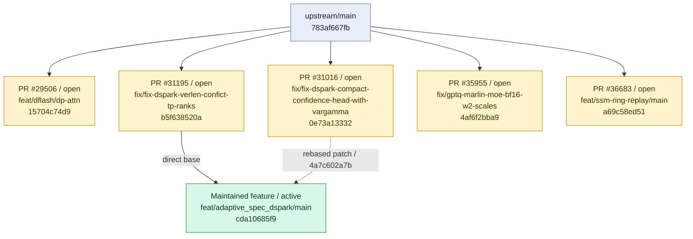

# Branch Relationship Graph

<!-- Generated by scripts/render_branch_graph.py; edit the YAML sources instead. -->

Registry updated: `2026-09-01`

Solid arrows are direct bases or ordered stack composition. Dotted arrows are rebased patches.

## Managed branches

## Stack: `dspark-adaptive`

Source: [`dspark-adaptive.yaml`](stacks/dspark-adaptive.yaml)

```mermaid
flowchart LR
    stack_base_dspark_adaptive["upstream/main<br/>783af667fb"]
    stack_dspark_adaptive_1["dspark-tp-budget-sync<br/>direct_base<br/>b5f638520a"]
    stack_base_dspark_adaptive --> stack_dspark_adaptive_1
    click stack_dspark_adaptive_1 "https://github.com/sgl-project/sglang/pull/31195"
    stack_dspark_adaptive_2["dspark-runtime-gamma<br/>rebased_patch<br/>4a7c602a7b"]
    stack_dspark_adaptive_1 --> stack_dspark_adaptive_2
    click stack_dspark_adaptive_2 "https://github.com/sgl-project/sglang/pull/31016"
    stack_dspark_adaptive_3["dspark-profiling-guard<br/>feature_commit<br/>988846a4e0"]
    stack_dspark_adaptive_2 --> stack_dspark_adaptive_3
    stack_dspark_adaptive_4["dspark-batch-aware-graph-tier<br/>feature_commit<br/>f044291e72"]
    stack_dspark_adaptive_3 --> stack_dspark_adaptive_4
    stack_dspark_adaptive_5["dspark-pre-budget-token-tier<br/>feature_commit<br/>4229b39483"]
    stack_dspark_adaptive_4 --> stack_dspark_adaptive_5
    stack_dspark_adaptive_6["dspark-draft-extend-ragged-guard<br/>feature_commit<br/>1956aed8d8"]
    stack_dspark_adaptive_5 --> stack_dspark_adaptive_6
    stack_dspark_adaptive_7["dspark-runtime-config-adaptation<br/>feature_commit<br/>dd72332235"]
    stack_dspark_adaptive_6 --> stack_dspark_adaptive_7
    stack_dspark_adaptive_8["dspark-online-startup-profile<br/>feature_commit<br/>7b91216041"]
    stack_dspark_adaptive_7 --> stack_dspark_adaptive_8
    stack_dspark_adaptive_9["dspark-profile-worker-api-fix<br/>feature_commit<br/>cf593179d0"]
    stack_dspark_adaptive_8 --> stack_dspark_adaptive_9
    stack_dspark_adaptive_10["dspark-profile-pool-fix<br/>feature_commit<br/>01dcb70cf3"]
    stack_dspark_adaptive_9 --> stack_dspark_adaptive_10
    stack_dspark_adaptive_11["dspark-profile-lifecycle-fix<br/>feature_commit<br/>ed0a00def8"]
    stack_dspark_adaptive_10 --> stack_dspark_adaptive_11
    stack_dspark_adaptive_12["dspark-profile-grid-clamp<br/>feature_commit<br/>cda10685f9"]
    stack_dspark_adaptive_11 --> stack_dspark_adaptive_12
    stack_output_dspark_adaptive["feat/adaptive_spec_dspark/main<br/>active"]
    stack_dspark_adaptive_12 --> stack_output_dspark_adaptive
```

