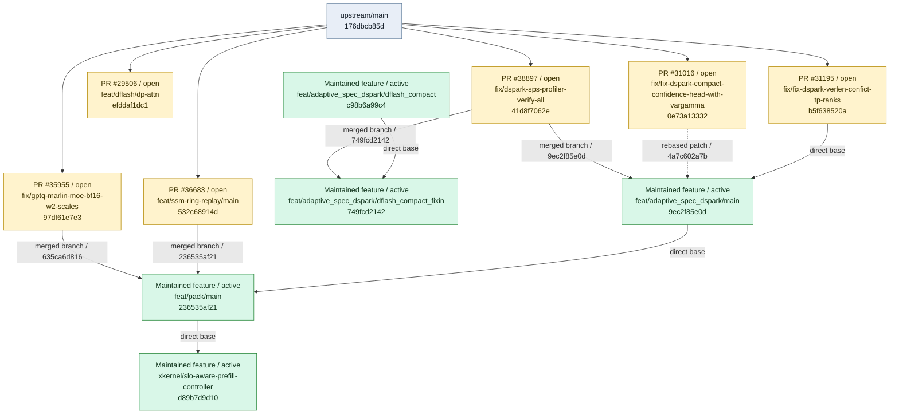
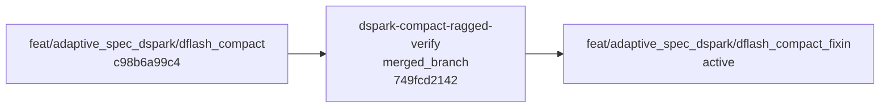

# Branch Relationship Graph

<!-- Generated by scripts/render_branch_graph.py; edit the YAML sources instead. -->

Registry updated: `2026-09-21`

Solid arrows are direct bases or ordered stack composition. Dotted arrows are rebased patches.

## Managed branches

## Stack: `adaptive-dspark-replayssm-gptq-marlin-pack`

Source: [`adaptive-dspark-replayssm-gptq-marlin-pack.yaml`](stacks/adaptive-dspark-replayssm-gptq-marlin-pack.yaml)

```mermaid
flowchart LR
    stack_base_adaptive_dspark_replayssm_gptq_marlin_pack["feat/adaptive_spec_dspark/main<br/>9ec2f85e0d"]
    stack_adaptive_dspark_replayssm_gptq_marlin_pack_1["replayssm-dflash-dspark<br/>merged_branch<br/>236535af21"]
    stack_base_adaptive_dspark_replayssm_gptq_marlin_pack --> stack_adaptive_dspark_replayssm_gptq_marlin_pack_1
    click stack_adaptive_dspark_replayssm_gptq_marlin_pack_1 "https://github.com/sgl-project/sglang/pull/36683"
    stack_adaptive_dspark_replayssm_gptq_marlin_pack_2["gptq-marlin-moe-bf16-w2-scales<br/>merged_branch<br/>635ca6d816"]
    stack_adaptive_dspark_replayssm_gptq_marlin_pack_1 --> stack_adaptive_dspark_replayssm_gptq_marlin_pack_2
    click stack_adaptive_dspark_replayssm_gptq_marlin_pack_2 "https://github.com/sgl-project/sglang/pull/35955"
    stack_adaptive_dspark_replayssm_gptq_marlin_pack_3["ragged-layout-nonblocking-host-construction<br/>feature_commit<br/>d56eaf7e0e"]
    stack_adaptive_dspark_replayssm_gptq_marlin_pack_2 --> stack_adaptive_dspark_replayssm_gptq_marlin_pack_3
    stack_adaptive_dspark_replayssm_gptq_marlin_pack_4["uniform-layout-dp-tier-preservation<br/>merged_branch<br/>11c7f83062"]
    stack_adaptive_dspark_replayssm_gptq_marlin_pack_3 --> stack_adaptive_dspark_replayssm_gptq_marlin_pack_4
    stack_adaptive_dspark_replayssm_gptq_marlin_pack_5["current-main-stack-refresh<br/>merged_branch<br/>236535af21"]
    stack_adaptive_dspark_replayssm_gptq_marlin_pack_4 --> stack_adaptive_dspark_replayssm_gptq_marlin_pack_5
    stack_output_adaptive_dspark_replayssm_gptq_marlin_pack["feat/pack/main<br/>active"]
    stack_adaptive_dspark_replayssm_gptq_marlin_pack_5 --> stack_output_adaptive_dspark_replayssm_gptq_marlin_pack
```

## Stack: `dflash-compact-fixin`

Source: [`dflash-compact-fixin.yaml`](stacks/dflash-compact-fixin.yaml)

## Stack: `dspark-adaptive`

Source: [`dspark-adaptive.yaml`](stacks/dspark-adaptive.yaml)

## Stack: `xkernel-slo-aware-prefill-controller`

Source: [`xkernel-slo-aware-prefill-controller.yaml`](stacks/xkernel-slo-aware-prefill-controller.yaml)

